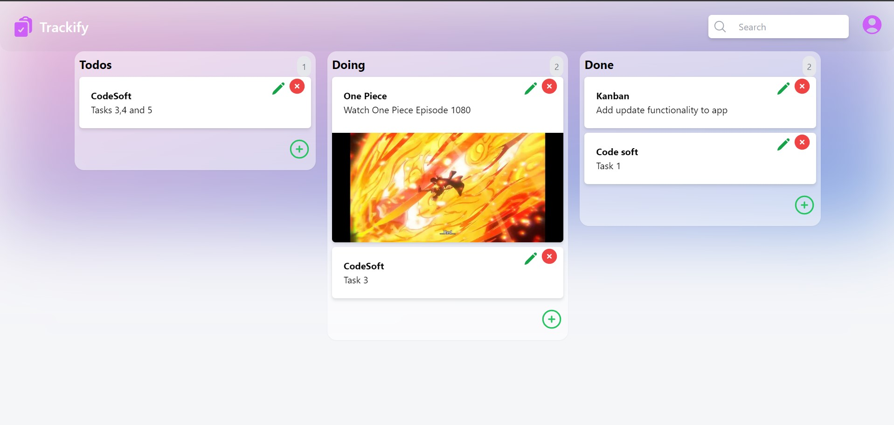

# Kanban Board Task Management



## Description

Kanban Board Task Management is a web application built using Next.js for efficient task tracking and management. This Kanban board allows you to organize your tasks into customizable columns, providing a visual representation of your workflow. You can easily move tasks between columns, update their status, and collaborate with your team in a streamlined manner.

### Features

- **Drag-and-Drop:** Move tasks between columns with a simple drag-and-drop interface.
- **Customizable Columns:** Tailor the board to your specific workflow with customizable columns.
- **Task Details:** Add descriptions, due dates, and assign tasks to team members.
- **Collaboration:** Collaborate with your team in real-time by sharing the board.
- **Efficient Task Management:** Stay organized and boost productivity with this intuitive tool.
- - **Search:** You can make use of search box searching task.

## Dependencies

This project relies on the following dependencies:

- **@headlessui/react:** v1.7.17
- **@heroicons/react:** v2.0.18
- **@types/react:** v18.2.21
- **@types/react-dom:** v18.2.7
- **appwrite:** v11.0.1
- **autoprefixer:** v10.4.15
- **eslint:** v8.48.0
- **eslint-config-next:** v13.4.19
- **hoist-non-react-statics:** v3.3.2
- **install:** v0.13.0
- **next:** v13.4.19
- **npm:** v9.8.1
- **postcss:** v8.4.28
- **react:** v18.2.0
- **react-beautiful-dnd:** v13.1.1
- **react-dom:** v18.2.0
- **tailwindcss:** v3.3.3
- **zustand:** v4.4.1

Please make sure to install these dependencies using `npm` or `yarn` before running the project.

## Getting Started

To get started with this project, follow these steps:

1. Clone this repository to your local machine.

```bash
git clone https://github.com/Atharva0506/Kanban-Board-Task-Management.git

